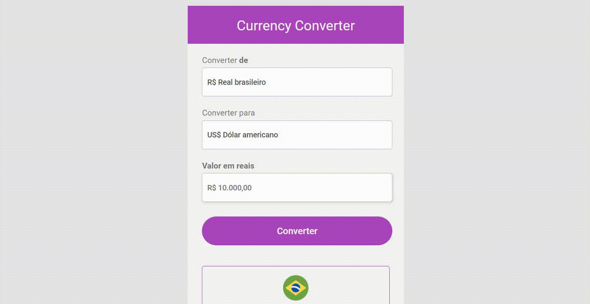

# Currency Converter

>  O projeto é um conversor de moedas que converte de reais para diferentes moedas.

Confira a aplicação: https://kayke-fujinaka.github.io/Currency-Converter/

## :page_facing_up: Explicação

A aplicação é um conversor de moedas. Ele converte de real para 11 diferentes moedas, sendo elas: Dólar americano, Dólar canadense, Dólar australiano, Euro, Libra esterlina, Franco suíço, Coroa dinamarquesa, Rand sul-africano, Iene japonês, Won sul-coreano e Bitcoin.

<b>Como usar?</b>

Para utilizar, você precisa colocar um valor no input que está escrito "R$ 10.000,00". Depois só precisa apertar no botão e ver o valor convertido. 

Além disso, o projeto disponibiliza trocar o valor convertido em outras moedas. Para selecionar basta clicar no select e vai ter 11 opções de moedas e só escolher uma delas. Ao clicar a formatação, conversão, nome e imagem que está na parte de baixo do projeto irá alterar de acordo com a moeda selecionada.

<b>Informações!</b>

O valor de 1 moeda para real até o dia (08/04/2022 15h27) que foi realizada esta aplicação:

Dólar americano = 4,74 
Dólar canadense = 3.76 
Dólar australiano = 3.53 
Euro = 5,15 
Libra esterlina = 6,17 
Franco suíço = 5.06 
Coroa dinamarquesa = 0.69 
Rand sul-africano = 0.32 
Iene japonês = 0,038 
Won sul-coreano = 0,0039 
Bitcoin = 204674,93

As moedas estão formatadas de acordo como é em seu país.

Por exemplo: Temos R$ 1000 reais convertidos em Won serão aproximadamente 256 mil wons, ou seja, esse dinheiro formatado ficará ₩256,410 e não ₩256.410 como é a formatação do Brasil e outro países do mundo.

## :dart: Etapas do Projeto ##

:heavy_check_mark: Estruturação da página com HTML;\
:heavy_check_mark: Estilização da página utilizando CSS;\
:heavy_check_mark: Aplicando o JavaScript;\
:heavy_check_mark: Chamar uma função ao clicar no botão;\
:heavy_check_mark: Converter o valor da moeda ao clicar no botão;\
:heavy_check_mark: Ao mudar a opção do Select a imagem e o nome da moeda mudam;\
:heavy_check_mark: Formatação da moeda com biblioteca interna do JavaScript (Intl.NumberFormat);\
:heavy_check_mark: Responsividade;\
:heavy_check_mark: Adicionei mais 5 moedas, sendo: Dólar canadense, Dólar australiano, Franco suíço, Coroa dinamarquesa e Rand;\
:heavy_check_mark: Finalizado;

## :rocket: Tecnologias ##

Neste projeto foram utilizadas as seguintes ferramentas:

- [Html](https://developer.mozilla.org/pt-BR/docs/Web/HTML/Element/html/)  
- [CSS](https://developer.mozilla.org/pt-BR/docs/Web/CSS)  
- [JavaScript](https://developer.mozilla.org/pt-BR/docs/Web/JavaScript) 
- [Intl.NumberFormat](https://developer.mozilla.org/pt-BR/docs/Web/JavaScript/Reference/Global_Objects/Intl/NumberFormat) 

## 🤝 Colaboradores

Agradecemos à seguinte pessoa que contribuiu para este projeto:

<table>
  <tr>
    <td align="center">
      <a href="#">
         
        
          <b>Kayke Alves Fujinaka</b>
        
      </a>
    </td>
  </tr>
</table>

## 📝 Licença

Este projeto está sob licença. Consulte o arquivo [LICENSE](LICENSE.md) para obter mais detalhes.

&#xa0;

<a href="#top">Volte para o topo</a>